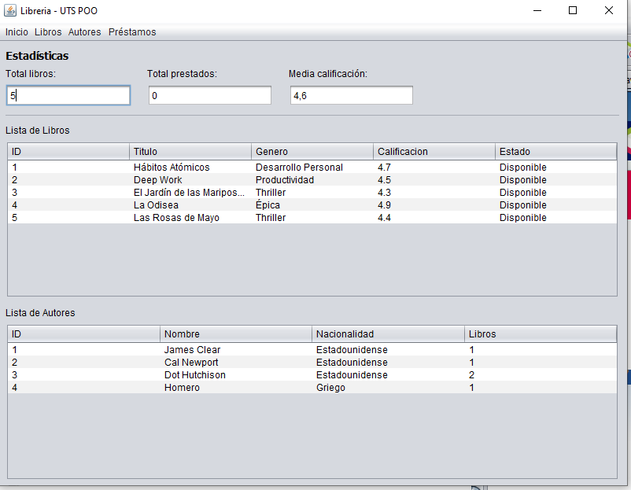
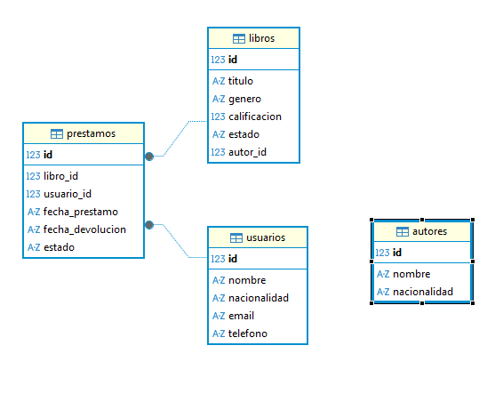

# Proyecto Librería

**Proyecto del Taller de Programación Orientada a Objetos**  
Tecnología en Desarrollo de Sistemas Informáticos  
📅 I Semestre 2026  
👨‍🏫 Profesor: Mag. Carlos Adolfo Beltrán Castro  
👨‍💻 Estudiantes: David Emilio Sabogal Herreño - 1101752634  


*Imagen de la Pantalla Inicial con Menú del Proyecto*


*Diagrama de Clases del Proyecto*

## 🚀 Descripción del Proyecto

Este proyecto simula un sistema de gestión de una librería con **Java SE – Swing** y base de datos **SQLite**. Incluye navegación entre diferentes secciones y la funcionalidad de consulta y registro de **Libros**, **Autores**, **Usuarios** y **Préstamos**. La arquitectura sigue el patrón **DAO (Data Access Object)** para separar la lógica de base de datos de la interfaz gráfica, aplicando los principios de encapsulamiento de la Programación Orientada a Objetos.

## 📂 Estructura del Proyecto

- **Menú Principal** con estadísticas y listados:
  - Panel de inicio con total de libros, total prestados y media de calificación
  - Tabla de libros (ID, título, género, calificación, estado)
  - Tabla de autores (ID, nombre, nacionalidad, cantidad de libros)
- **Préstamos** – Consulta de todos los préstamos y registro de nuevos préstamos con selección de libro y usuario
- **Usuarios** – Gestión de usuarios registrados en el sistema
- **Salir** – Cierre de la aplicación

## 🧰 Lista de Tecnologías Usadas

| Tecnología | Uso |
|-----------|-----|
| **Java 8+** | Lenguaje de programación principal |
| **Swing** | Framework de interfaz gráfica (GUI) |
| **SQLite** | Base de datos local embebida |
| **JDBC** | Conexión a base de datos sin ORM |
| **NetBeans** | IDE de desarrollo y construcción (Apache Ant) |
| **Git** | Control de versiones |

## 🔧 Instalación y ejecución

1. Clonar o descomprimir el proyecto
2. Abrir el proyecto en **Apache NetBeans** (`File → Open Project`)
3. Limpiar y construir (`Run → Clean and Build Project`)
4. Ejecutar la clase principal: `uts.poo.vista.MenuPrincipal`

> La base de datos SQLite se crea automáticamente en la raíz del proyecto con las tablas necesarias y datos de ejemplo al iniciar la aplicación por primera vez.

## 📁 Paquetes del Proyecto

```
src/uts/poo/
├── Libro.java            → Clase modelo: Libro
├── Usuario.java          → Clase modelo: Usuario
├── ConexionBD.java       → Gestor de conexión e inicialización del esquema
├── LibroDAO.java         → Operaciones CRUD de libros
├── AutorDAO.java         → Consultas de autores con conteo de libros
├── UsuarioDAO.java       → Operaciones CRUD de usuarios
├── PrestamoDAO.java      → Operaciones de préstamos con transacciones
└── vista/
    ├── MenuPrincipal.java        → Ventana principal con estadísticas y tablas
    ├── VistaPrestamos.java       → Diálogo de lista de préstamos
    └── VistaNuevoPrestamo.java   → Diálogo para registrar nuevo préstamo